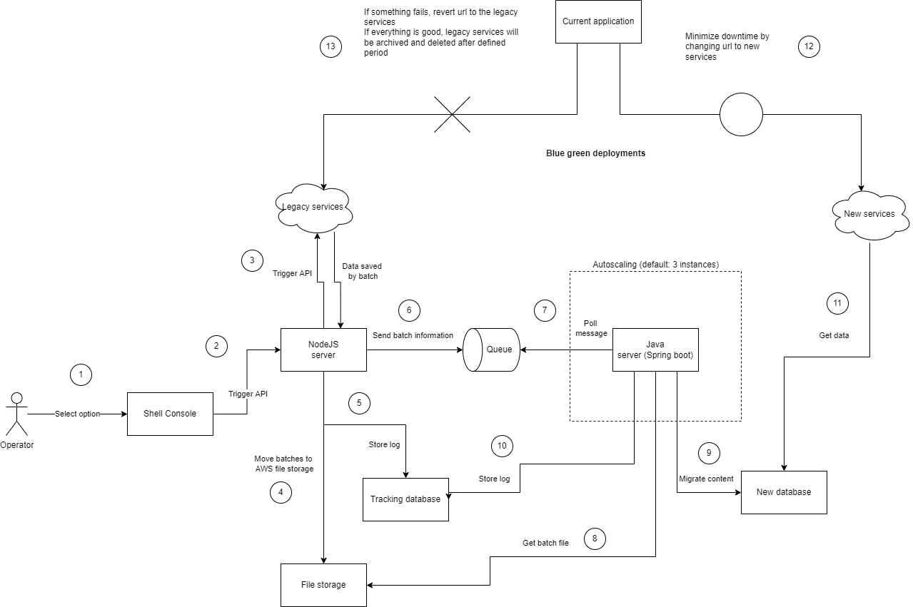

# content-migration-demo

## Context
Japanese health care company is using the legacy services and want to migrate content to the cloud to reduce cost.   
The legacy services don't have the direct access to database, only download content APIs.   
There are new requirements about the data formats and the customers want to use them for the content migration.  
The customers will be the people who do the migration.  
We must provide them the packaged, easy, automated solution.  
Code as a infrastructure templates will be used to reduce manual tasks as much as possible.   

## Technologies used
Spring Boot  
NodeJS  
Shell  
any FIFO queue e.g. Amazon SQS  
any database e.g. Amazon Aurora  
any container orchestration tool e.g. Amazon ECS  
any file storage e.g. Amazon EFS  
secret management tool e.g. AWS Secret Manager

## Overview process

## Detailed steps
1. Operator select an option to start the migration process
2. The console will trigger an API to the NodeJS server
3. NodeJS server trigger an API to the legacy services and download the data by multiple batches
4. NodeJS server will transfer the downloaded files to the file storage
5. After finishing the transfer, NodeJS server will store the log to the tracking database, and mark the batch status as DOWNLOADED
6. NodeJS server sends batch information the queue, each batch will have one message respectively
7. Java server will pull the messages from the queue and start processing
8. Java server get files from the file storage
9. Java server will migrate content, change data format (data normalization) and save it to the new database.
10. After finishing the migration, Java server will store the log to the tracking database, and mark the batch status as PROCESSED
11. New services will get data from new database using new format
12. Current application will change the backend urls to new services and verify the business logic
13. If there is an error (e.g. missing data, wrong format), the operator can revert to the legacy urls in the application settings. Otherwise, legacy services will be archived and shut down in the future.

